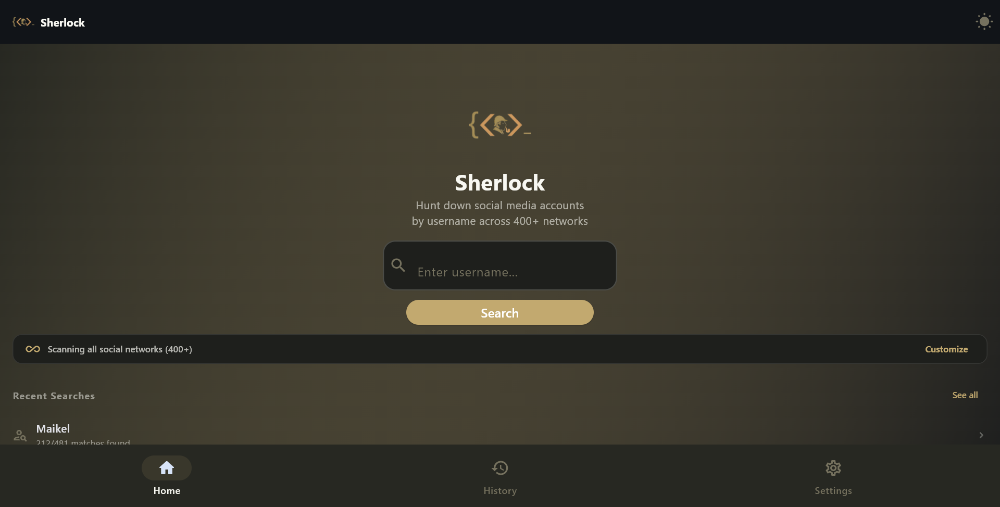
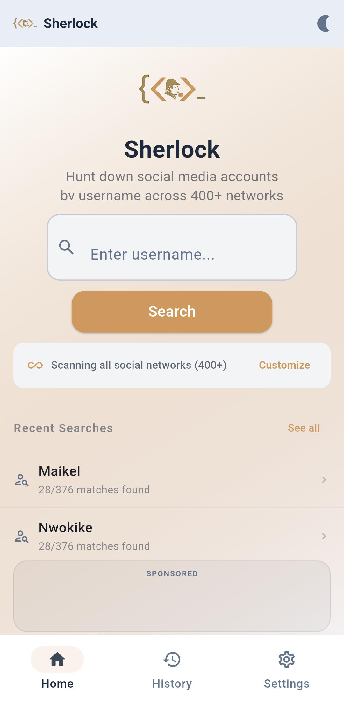
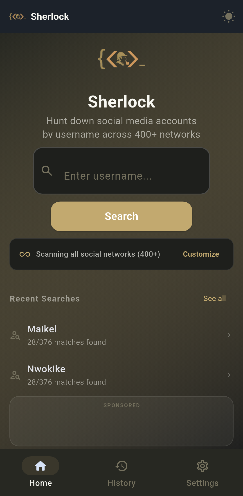
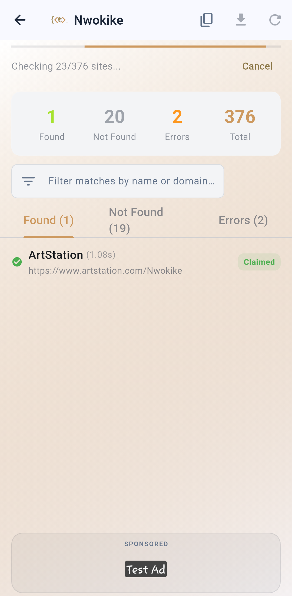
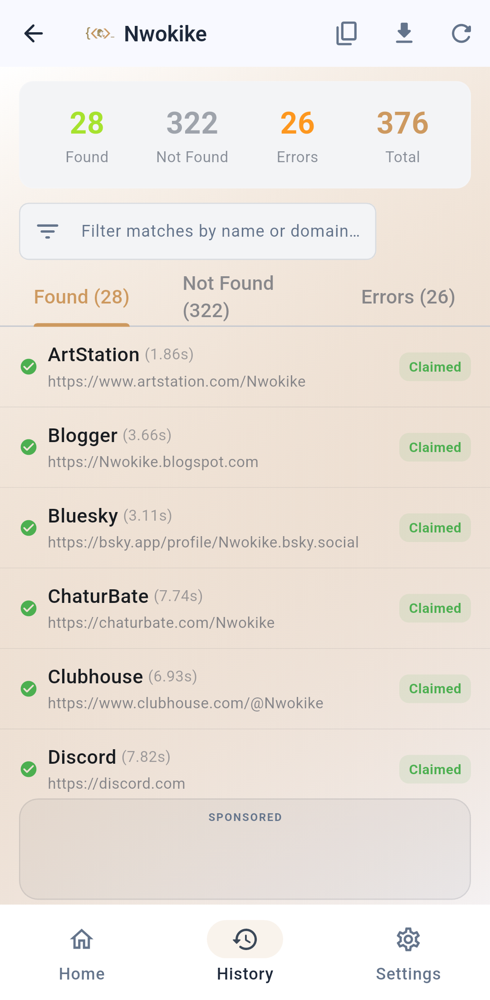
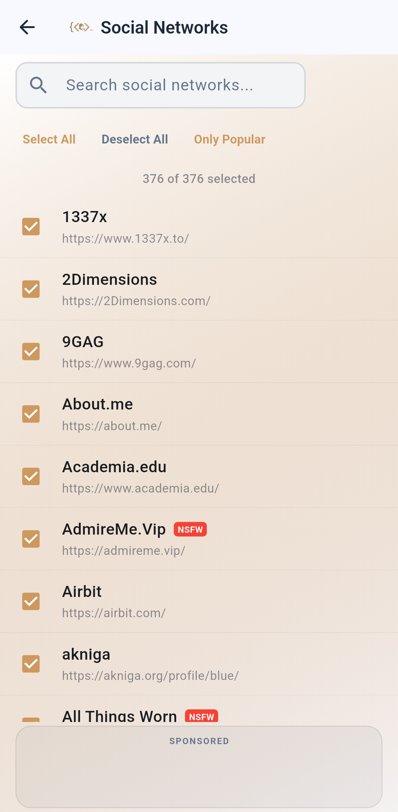
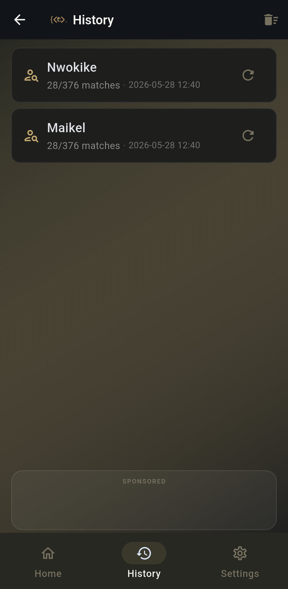
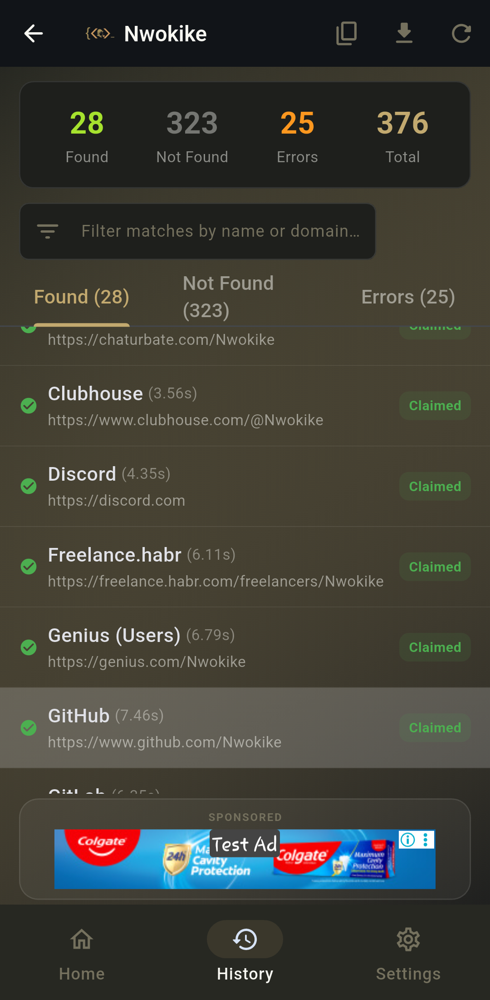
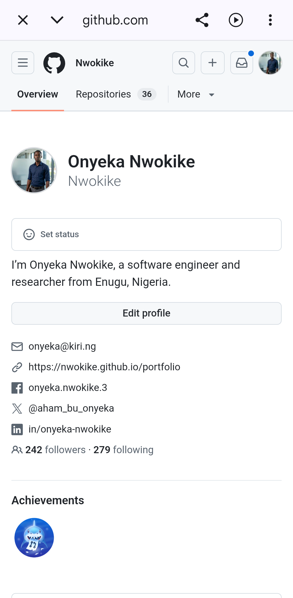
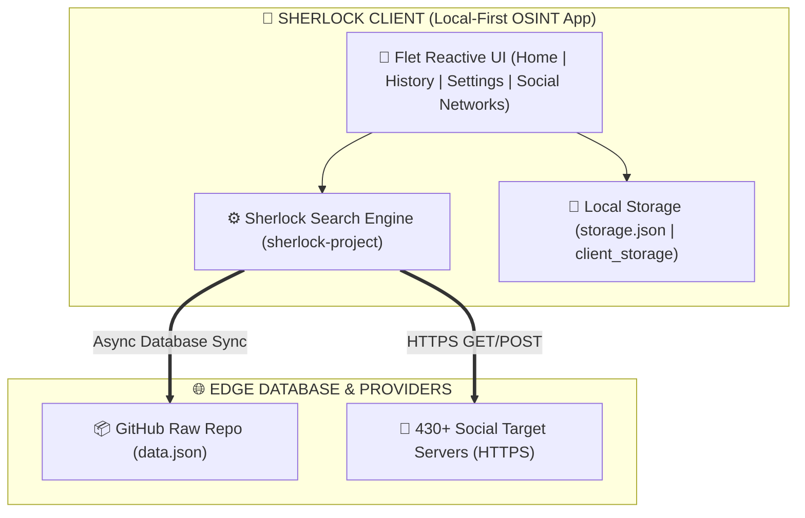

  

  A high-performance, private OSINT search platform to hunt down social media profiles by username across 430+ networks simultaneously

  
  
   
  

---

## Download

| Platform | Download | Notes |
| :---: | :---: | :--- |
| 🪟 **Windows** | [**Sherlock_Setup.exe**](https://github.com/Nwokike/Sherlock/releases/latest/download/Sherlock_Setup.exe) | Windows 10/11 64-bit Installer |
| 🤖 **Android** |  | Recommended for most mobile users |

### Android Architecture Build Splits

| Variant | Download | Notes |
| :--- | :---: | :--- |
| 📱 **ARM64** (most phones) | [**sherlock-arm64-v8a.apk**](https://github.com/Nwokike/Sherlock/releases/latest/download/sherlock-arm64-v8a.apk) | Modern 64-bit Android devices |
| 📱 **ARMv7** (older phones) | [**sherlock-armeabi-v7a.apk**](https://github.com/Nwokike/Sherlock/releases/latest/download/sherlock-armeabi-v7a.apk) | Legacy 32-bit Android devices |
| 💻 **x86_64** (emulators) | [**sherlock-x86_64.apk**](https://github.com/Nwokike/Sherlock/releases/latest/download/sherlock-x86_64.apk) | Chromebooks & Android emulators |

---

## Core Capabilities

| Capability | Description |
| :--- | :--- |
| **430+ Social Networks** | Simultaneously scans the largest index of international, regional, and specialized networks (GitHub, X, Instagram, TikTok, Steam, Reddit, Spotify, etc.) in seconds. |
| **Fast Offline Scans** | Runs high-performance queries locally. Features an offline-first local database to scan instantly without active internet. |
| **Selective Target Scope** | Bulk selection management. Focus your scans by enabling "Select All", "Deselect All", or "Only Popular" (popular platforms finish in under 1.5 seconds). |
| **Throttled Real-Time Ticking** | Features a thread-safe progress collect-notifier throttled to a smooth 250ms interval, preventing rendering freezes and allowing live counter ticking. |
| **Premium Data Exports** | Export complete scan results to your system Downloads folder as clean Plain Text, CSV spreadsheets, or beautifully structured Excel (.xlsx) files. |
| **Local Sandbox Security** | Hardened sandboxed storage framework guaranteeing zero permission conflicts on both Windows and Android environments. |

---

## Screenshots

### Desktop Experience

  

<em>Desktop Search Interface (Light Mode) — Pure white parchment background optimized for high contrast, clean typography, and instant clipboard pasting.</em>

  

<em>Desktop Scan Results (Dark Mode) — Classic Monokai earth-charcoal theme featuring active status breakdowns, live filtering, and bulk browser launching.</em>

### Mobile Experience

<table>
  <tr>
    <td width="50%"></td>
    <td width="50%"></td>
  </tr>
  <tr>
    <td align="center"><em>Home Dashboard (Light) — Pristine logo header layout displaying recent lookups.</em></td>
    <td align="center"><em>Home Dashboard (Dark) — Monokai-optimized interface with quick-theme header toggle.</em></td>
  </tr>
</table>

<table>
  <tr>
    <td width="50%"></td>
    <td width="50%"></td>
  </tr>
  <tr>
    <td align="center"><em>Live Search Ticking — Fluid progress counter with cancellation action.</em></td>
    <td align="center"><em>Scan Complete — Segmented tabs displaying found match cards.</em></td>
  </tr>
</table>

<table>
  <tr>
    <td width="50%"></td>
    <td width="50%"></td>
  </tr>
  <tr>
    <td align="center"><em>Selective Site Switcher — Custom toggle checks to prune search scope.</em></td>
    <td align="center"><em>Recent History Log — Complete chronological list of previous runs.</em></td>
  </tr>
</table>

<table>
  <tr>
    <td width="50%"></td>
    <td width="50%"></td>
  </tr>
  <tr>
    <td align="center"><em>Detailed View Card — Highlighted bronze-gold outline matching logo.</em></td>
    <td align="center"><em>Browser Integration — Double-check live profile directly via built-in web views.</em></td>
  </tr>
</table>

---

## Features

- **Gold-Branded Design System** — Custom Solarized Light (Pure White) and classic Monokai themes aligned perfectly to the bronze-gold detective logo.
- **Bulk Profile Opener** — Open all discovered social profiles in individual browser tabs in one click.
- **Live Text-Search Filters** — Instantly filter hundreds of results in real-time as the background scanner is running.
- **GitHub Database Syncing** — Fetch, validate, and write the latest master database rules from GitHub to guarantee search accuracy.
- **Preloaded Interstitial Ads** — Intelligent Google AdMob integration that buffers and displays interstitial ads seamlessly on mobile platforms.
- **Debounced Storage Writes** — Prevents disk I/O bottlenecks and race conditions when modifying search parameters.
- **Ruff Compliance** — Clean, formatted, and strictly linted Python codebase.

---

## Architecture

| Layer | Technology | Purpose |
| :--- | :--- | :--- |
| **Frontend** | Flet (Flutter engine) | Cross-platform UI with clean responsive views and smooth page transitions |
| **Scan Core** | `sherlock-project` runtime | Native multi-threaded OSINT username matching engine |
| **Async Client** | `httpx` (connection pooling) | Dispatches fast asynchronous target network GET/POST requests |
| **Local Database** | Flat JSON Storage (`storage.json`) | Ultra-fast local key-value storage for settings, theme state, and logs |
| **Online Provider** | GitHub Raw API | Live database updates providing the latest social rules |

### Visual Flow

---

## Scan Performance Guide

To optimize execution speed across various platforms, reference this settings guide:

| Scan Profile | Targets | Estimated Time | Best Suited For |
| :--- | :---: | :---: | :--- |
| **Popular Only** | ~35 Popular Sites | **1.5 Seconds** | Quick check on mainstream platforms (GitHub, X, Instagram, TikTok, Reddit) |
| **Custom Selection** | Selected Subset | **Depends on size** | Specific investigation focused on professional or gaming networks |
| **Full Sweep** | 430+ Sites | **25 - 45 Seconds** | Deep exhaustive OSINT reports and full footprint audits |

---

## Privacy & Security

Sherlock is designed with a strict **Privacy-First** philosophy:

1. **Local Connections**: All network scans are sent directly from your own device IP address. No middleman, proxy, or server tracking.
2. **Zero Logging**: We do not log, track, or share your search history, checked usernames, or discovered profiles.
3. **Sandbox Directories**: Mapped directories use Android secure sandboxing ensuring zero access to other system folders.
4. **Data Sovereignty**: Generated reports (.csv, .xlsx, .txt) reside 100% locally in your default system Downloads folder.

---

## Legal Disclaimer

Sherlock is an OSINT information-gathering tool designed to audit public footprints. It only checks publicly accessible page structures. Users are solely responsible for ensuring compliance with target platforms' Terms of Service and local privacy regulations (e.g. GDPR, CCPA). The authors take no responsibility for misuse of this tool.
