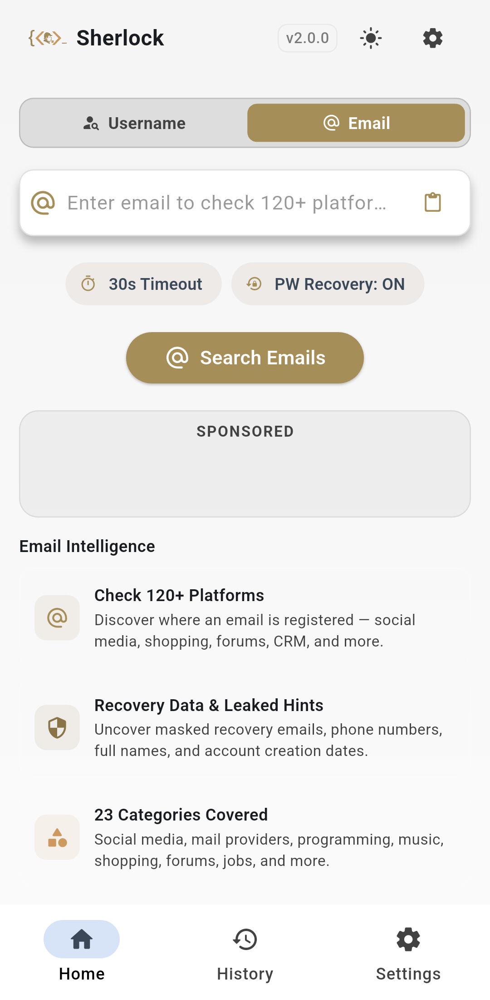
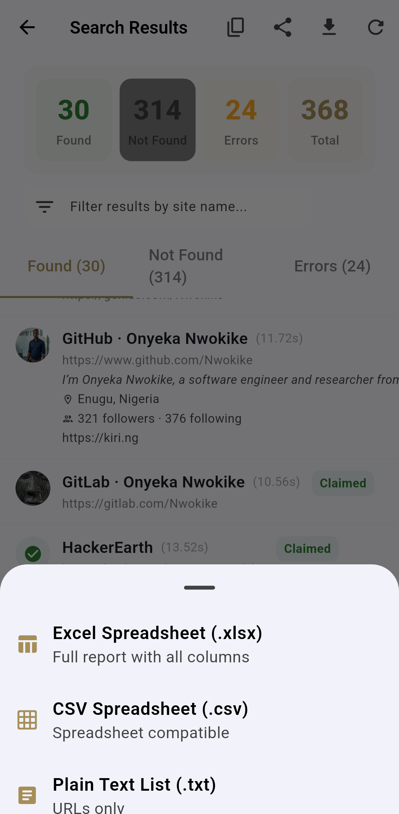
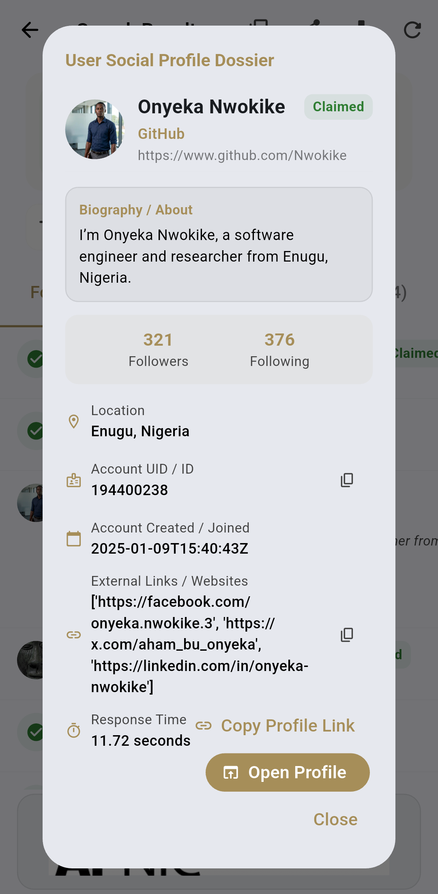
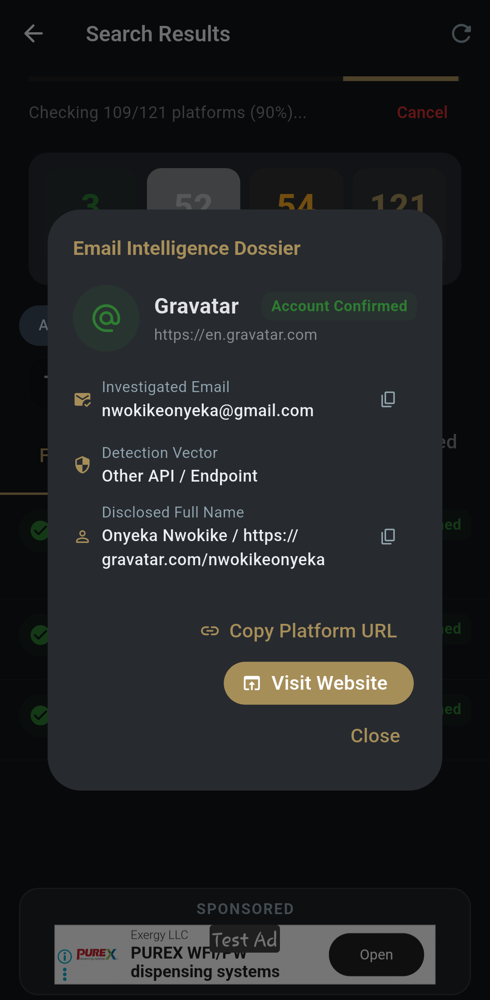
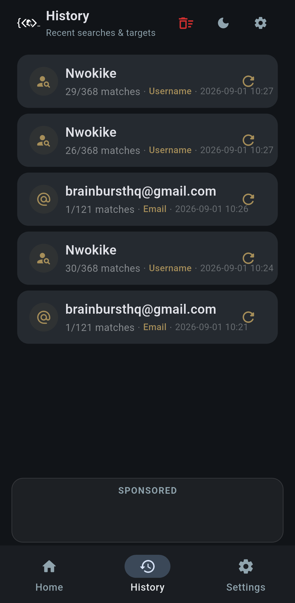
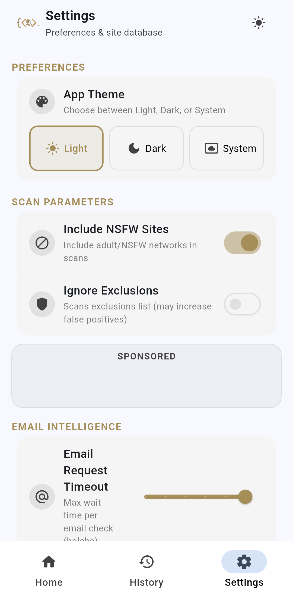
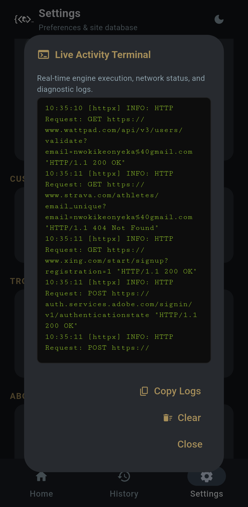
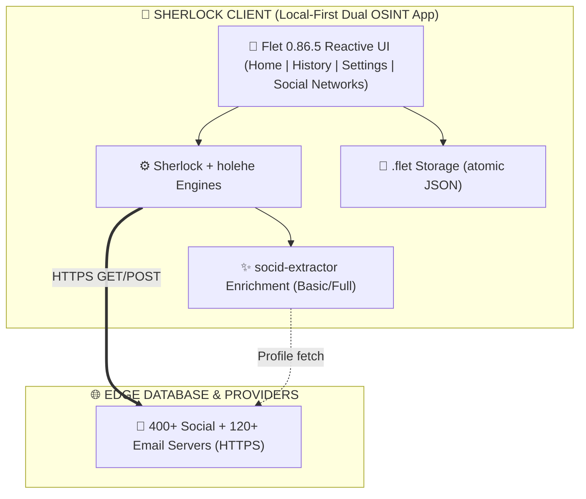

  

  Dual-mode OSINT — hunt usernames across 400+ networks and emails across 120+ platforms simultaneously

  
  
  
  
  
  

---

## Download

| Platform | Download | Notes |
| :---: | :---: | :--- |
| 🤖 **Android** |  | Recommended for Android mobile users |
| 🪟 **Windows** |  | Automated standalone setup installer with desktop shortcut integration |
| 🐧 **Linux (Debian/Ubuntu)** |  | Desktop package tailored for Ubuntu, Debian, Linux Mint & Pop!_OS |
| 🎩 **Linux (Fedora/RHEL)** |  | Desktop package tailored for Fedora, openSUSE, RHEL & CentOS |
| 📦 **Linux (Universal Portable)** |  | Universal standalone portable archive for Arch, Alpine, Steam Deck & all distros |

### Android Architecture Build Splits

| Variant | Download | Notes |
| :--- | :---: | :--- |
| 📱 **ARM64** (most phones) | [**sherlock-arm64-v8a.apk**](https://github.com/Nwokike/Sherlock/releases/latest/download/sherlock-arm64-v8a.apk) | Modern 64-bit Android devices |
| 📱 **ARMv7** (older phones) | [**sherlock-armeabi-v7a.apk**](https://github.com/Nwokike/Sherlock/releases/latest/download/sherlock-armeabi-v7a.apk) | Legacy 32-bit Android devices |
| 💻 **x86_64** (emulators) | [**sherlock-x86_64.apk**](https://github.com/Nwokike/Sherlock/releases/latest/download/sherlock-x86_64.apk) | Chromebooks & Android emulators |

---

## Core Capabilities

| Capability | Description |
| :--- | :--- |
| **400+ Username Networks** | Username OSINT via `sherlock-project` — GitHub, Instagram, Discord, Telegram, SoundCloud, and more. Wildcard `user{?}name` → 3 variants. |
| **120+ Email Platforms** | Email OSINT via `holehe` — register/login/recovery checks with masked recovery email + phone hints, method badges, and flaky-platform warnings. |
| **Profile Enrichment** | `socid-extractor` (164 schemes) — avatar, bio, followers, location, company, verified, personal links. Basic (fast) / Full (API mutations) modes. |
| **Fast Offline Scans** | Local-first database — scan instantly without an initial download. |
| **Selective Target Scope** | Bulk selection: Select All / Deselect All / Popular Only — from the targets card on Home. |
| **Premium Data Exports** | Plain Text, CSV, and Excel (.xlsx) via system file picker — BottomSheet chooser with drag handle. |
| **History + Typeahead** | Local search history with `Dismissible` swipe-to-delete and `SearchBar` typeahead suggestions. |

---

## Screenshots

<table>
  <tr>
    <td width="50%"></td>
    <td width="50%"></td>
  </tr>
  <tr>
    <td align="center"><em>Username search across 400+ social networks with quick scan options.</em></td>
    <td align="center"><em>Email lookup across 120+ platforms with password recovery checks.</em></td>
  </tr>
</table>

<table>
  <tr>
    <td width="50%"></td>
    <td width="50%"></td>
  </tr>
  <tr>
    <td align="center"><em>Live results stream with Excel, CSV, and TXT export.</em></td>
    <td align="center"><em>Enriched profile dossier with bio, follower count, and links.</em></td>
  </tr>
</table>

<table>
  <tr>
    <td width="50%"></td>
    <td width="50%"></td>
  </tr>
  <tr>
    <td align="center"><em>Email dossier with account status and leaked recovery hints.</em></td>
    <td align="center"><em>Search history with past results and quick re-run.</em></td>
  </tr>
</table>

<table>
  <tr>
    <td width="50%"></td>
    <td width="50%"></td>
  </tr>
  <tr>
    <td align="center"><em>Settings for theme, scan options, and request timeouts.</em></td>
    <td align="center"><em>Live activity terminal showing real-time network logs.</em></td>
  </tr>
</table>

---

## Features

- **Gold-Branded Design System** — Solarized Light (Pure White) and Monokai themes aligned to the bronze-gold detective logo. `ScrollbarTheme` / `ChipTheme` / `TabBarTheme` / `CardTheme` / `PageTransitionsTheme` unified in `AppTheme`.
- **Dual-Mode OSINT** — Username (sherlock-project) + Email (holehe) with material `SegmentedButton` pill and type-ahead `SearchBar`.
- **Profile Enrichment** — `socid-extractor` post-scan enrichment: avatar guard (`https` only), bio, followers, location, company, verified badge, personal link — Basic/Full modes via `mutate_url` API schemes.
- **Live Text-Search Filters** — Instantly filter hundreds of results as the scanner runs. `ListView(build_controls_on_demand=True)` virtualization + `SelectionArea` long-press.
- **Tap-to-Open + Share + Haptic** — Tap result → browser; copy/share via `Clipboard` + `Share`; `HapticFeedback` on search/copy/share.
- **Network & Proxy** — `sherlock(..., proxy=)` via Settings → Network & Proxy (`socks5://` / `http://`).
- **Wildcard `user{?}name`** — Expands to `user_name`, `user-name`, `user.name` automatically.
- **Email Concurrency + Filters** — Slider 5–30 (default 5), Found-Only toggle, method filter (`All` / `Register` / `Login` / `Recovery`), flaky-platform threshold.
- **History** — `Dismissible` swipe-to-delete rows, `Banner` offline strip, `SearchBar` history typeahead, type-ahead `Chip` filters.
- **Interstitial Frequency Capping** — DDGS-style every-3rd-search cadence (`search_count % 3 == 0` via `state.search_count`).
- **Custom Database Manifest** — Point the scanner at your own site-database JSON (via Settings) for specialized investigations.
- **Markdown Release Notes** — `UpdateDialog` renders rich `Markdown(GITHUB_WEB)` changelogs with tappable links.
- **Export BottomSheet** — Material 3 `BottomSheet` (drag handle, `ListTile` per format) replaces `AlertDialog`.
- **Debounced Storage Writes** — Prevents disk I/O bottlenecks and race conditions when modifying search parameters.
- **Ruff Compliance** — Clean, formatted, and strictly linted Python codebase.

---

## Architecture

| Layer | Technology | Purpose |
| :--- | :--- | :--- |
| **Frontend** | Flet 0.86.5 (Flutter 3.44) | Cross-platform UI — `SegmentedButton`, `Chip`, `Banner`, `BottomSheet`, `Dismissible`, `Markdown` + services (`HapticFeedback`, `Share`, `Connectivity`) |
| **Scan Core** | `sherlock-project 0.16.0` + `holehe 1.61` | Username (multi-threaded `sherlock`) + Email (async `holehe` semaphore `state.email_concurrency`) |
| **Enrichment** | `socid-extractor 0.1.1` (164 schemes, 449 fields) | Post-scan avatar/bio/metrics via `batch_enrich` (Basic/Full `use_mutations`) |
| **Ads** | `flet-ads 0.86.5` | `BannerAd 320×50` + `InterstitialAd` (3-search capping) + UMP `ConsentManager` |
| **Local Database** | `.flet/storage/data` (`storage.json`) | Debounced atomic `JSON` store — settings, theme, selection scope, site-name cache, history |

### Visual Flow

```mermaid
graph TB
    subgraph SHERLOCK_CLIENT ["📱 SHERLOCK CLIENT (Local-First Dual OSINT App)"]
        UI["🎨 Flet 0.86.5 Reactive UI (Home | History | Settings | Social Networks)"]
        Engine["⚙️ Sherlock + holehe Engines"]
        Enrich["✨ socid-extractor Enrichment (Basic/Full)"]
        Storage["💾 .flet Storage (atomic JSON)"]
        UI --> Engine
        Engine --> Enrich
        UI --> Storage
    end

    subgraph GLOBAL_RESOURCES ["🌐 EDGE DATABASE & PROVIDERS"]
        Targets["🎯 400+ Social + 120+ Email Servers (HTTPS)"]
    end

    Engine ==>|HTTPS GET/POST| Targets
    Enrich -.->|Profile fetch| Targets
```

---

## Scan Performance Guide

To optimize execution speed, tune the sliders in Settings:

| Scan Profile | Targets | Estimated Time | Best Suited For |
| :--- | :---: | :---: | :--- |
| **Popular Only** | ~15 Major Platforms | **Under 5 Seconds** | Quick check on mainstream platforms |
| **Custom Selection** | Selected Subset | **Depends on size** | Focused investigation (professional / gaming networks) |
| **Email (holehe)** | 120 reasons | **10–30 s** | Use concurrency Slider 5–30 (default 5); higher = faster but more rate-limits |
| **Full Sweep** | 400+ Sites | **25–45 Seconds** | Deep exhaustive OSINT reports and full footprint audits |

---

## Privacy & Security

Sherlock is designed with a strict **Privacy-First** philosophy:

1. **Local Connections**: All network scans are sent directly from your own device IP address. No middleman, proxy, or server tracking — or via your configured `socks5://` / `http://` proxy if set.
2. **Zero Logging**: We do not log, track, or share your search history, checked usernames, or discovered profiles.
3. **Sandbox Directories**: `.flet/storage/data|cache|temp` via `FLET_APP_STORAGE_*` — the process CWD is `storage/data` during `flet run`, matching packaged app behavior (see `.flet/README.md`).
4. **Data Sovereignty**: Generated reports (.csv, .xlsx, .txt) reside 100% locally in your default system Downloads folder.

---

## Legal Disclaimer

Sherlock is an OSINT information-gathering tool designed to audit public footprints. It only checks publicly accessible page structures. Users are solely responsible for ensuring compliance with target platforms' Terms of Service and local privacy regulations (e.g. GDPR, CCPA). The authors take no responsibility for misuse of this tool.
